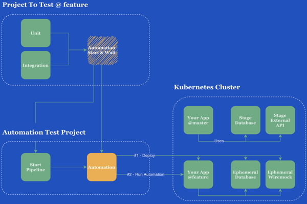

# goal

1. Understand the basic concepts of the cucumber  language.
2. understand the basic concepts of the test containers language.
3. mongo ,rabbitmq and kafka integration with test containers.
4. implement the ticket service domain using the test containers.

# concept

# module
* [x] mongo
* [x] rabbitmq
* [ ] mssql-server
* [ ] kafka
* [ ] wiremock
* [ ] real project integration
